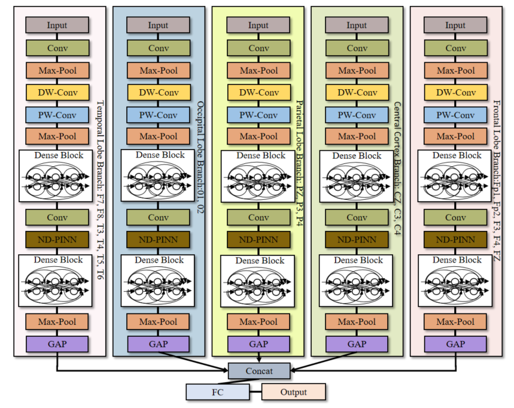
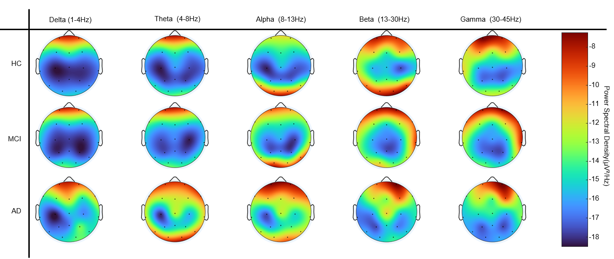
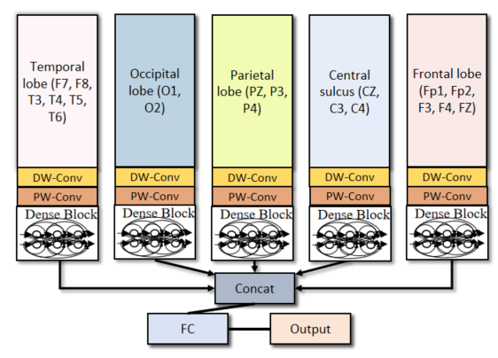
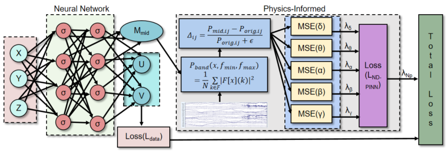
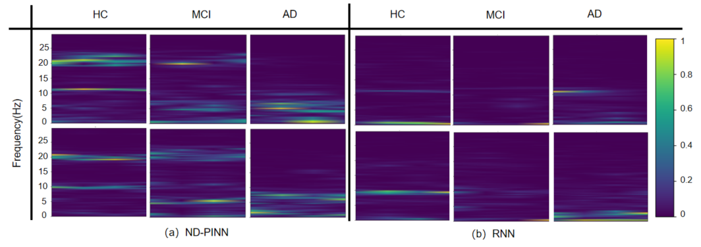
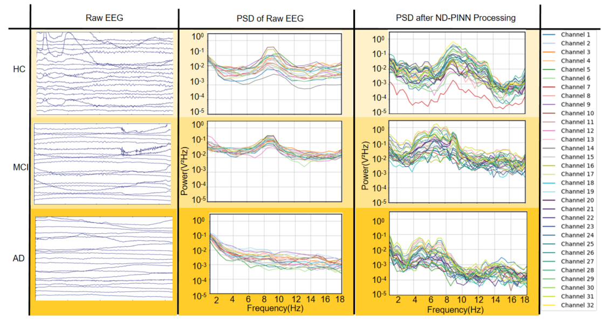
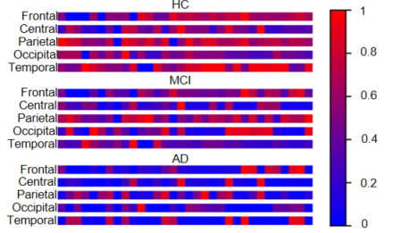

# Electroencephalographic Biomarker-Guided Early Detection of Alzheimer’s Disease via Cortically Subdivided Neurodynamic PINN

Figure 1: Detailed network structure of our proposed CodimNet.

Figure 2: EEG cortical power spectral density (PSD) topographical distributions across distinct cognitive states, delineating oscillatory frequency-dependent neurophysiological divergences among HC, MCI, and AD.  

## Methods

### Multibranch

Figure 3: Visualize the multi-branch structure.

### ND-PINN

Figure 4: Visualize the ND-PINN structure.

The proposed CodimNet is an advanced model for early diagnosis of Alzheimer's disease (AD) based on EEG.  This network combines multi-branch feature extraction, designed according to the anatomical segmentation of the international 10-20 system, with the Neurodynamic Physics-Informed Neural Network (ND-PINN) to better capture the characteristics of EEG signals in AD patients.  It outperforms nine other methods on the CAUEEG dataset, achieving state-of-the-art accuracy in AD identification.
## Installation

We run CodimNet and previous methods on a system running Ubuntu 22.04, with Python 3.8, PyTorch 2.1.0, and CUDA 12.1.

## Experiment

### Models Evaluation Without Cross-Validation

Figure 5: Comparison of CodimNet and other methods for AD diagnosis on the CAUEEG dataset using a fixed hold-out validation approach with EEG data.

CodimNet attaining peak performance across key classification metrics—Acc (76.27\%), AUC (85.27\%), and Sp (88.28\%)—outperforming its closest competitor, EEGNet, with a Se enhancement of 0.29 percentage points, an F1-score improvement of 2.07 percentage points, and a G-Mean augmentation of 1.89 percentage points, indicative of its enhanced robustness in mitigating class imbalance effects intrinsic to medical datasets.

### Models Evaluation Using Cross-Validation

Figure 6: Comparison of CodimNet and other methods for AD diagnosis on the non-overlapping version of the CAUEEG dataset using a four-fold cross-validation approach with EEG data.

## Ablation study

### Branch Ablation Study

Figure 7: Quantitative assessment of regional contributions to AD classification efficacy through cortical branch-specific ablation analysis.

### ND-PINN Quantitative Ablation Study

Figure 8: Quantitative evaluation of model classification efficacy across AD EEG tri-classification under varying instantiations of ND-PINN.

### Ablation Study Of ND-PINN In Different Intermediate Layers

Figure 9: Quantitative evaluation of ND-PINN instantiation across distinct intermediate-layer constraints. 

### Ablation Study Of Different Branches Of ND-PINN

Figure 10: Quantitative assessment of the impact of ND-PINN removal across distinct cortical branches on classification performance. 

### Branch Different Model Ablation Study

Figure 11: Quantitative classification performance across distinct recurrent neural network architectures instantiated within a multibranch paradigm. 

### ND-PINN constrained different brain rhythm Ablation Study

Figure 12: Performance metrics of ND-PINN under differential brain rhythm constraints, evaluating the impact of rhythm-specific spectral ablation on AD EEG classification.  

The effectiveness of the proposed module was systematically evaluated through the four-fold cross-validation ablation experiment, and its applicability and advantages in related tasks were verified.

## Model Visualization

Figure 13: Comparison of time-frequency spectral features of middle-layer embeddings between CodimNet and RNN.

Figure 14: Comparison of PSD plots with and without ND-PINN.

Figure 15: The heatmap generated by CodimNet shows the neuronal activation intensity of AD, MCI, and HC.

# Question

if you have any questions, please contact 'zhengliang.zhang@hdu.edu.cn'

